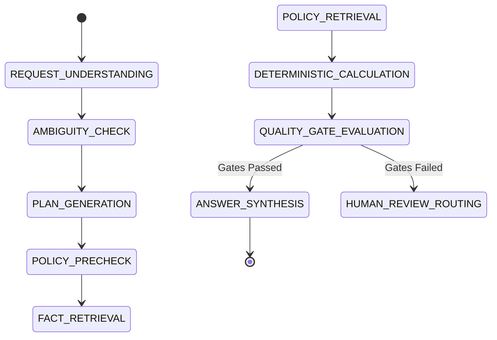

# Finance Intelligence — Agent Orchestration & Bounded Tool Design

> **Document ID**: `AGT-FIN-001`  
> **Status**: `Draft — Pending Phase 0 User Review`  
> **Classification**: `INTERNAL`

---

## 1. Orchestration Model & Model Provider Capability Matrix

### 1.1 Deterministic State Machine Control Plane
The agent orchestrator is implemented as a **Finite State Machine (FSM)**. The LLM NEVER controls loop execution or state transitions; it is invoked solely as a tool-selection and interpretation engine within defined state boundaries.



### 1.2 Model Provider Capability Matrix & Failover Rules
Automatic failover between model providers is NOT assumed to be seamless or identical. Failover from Anthropic Direct API to GCP Vertex AI is permitted **ONLY IF** data classification policy, data locality, model capabilities, prompt compatibility, and quality benchmarks match.

| Capability Feature | Anthropic Direct API | GCP Vertex AI (Claude Endpoint) | Failover Compatibility & Policy Rules |
|---|---|---|---|
| **Model Availability** | Claude 3.5 Sonnet / Haiku / Opus | Regional Availability (e.g. `europe-west1`) | Requires target model code mapping in `ModelProviderAdapter`. |
| **Tool Use & Schemas** | Native Anthropic Tool Spec | Vertex Anthropic Adaptor | Compatible; tool schemas must match strictly. |
| **Structured Output** | JSON Schema Enforcement | JSON Schema Enforcement | Compatible; validated via Pydantic DTOs. |
| **Prompt Caching** | Native Ephemeral Prompt Caching | Varying / Regional Support | **Performance Divergence**: Vertex AI caching support must be verified before failover. |
| **Document/PDF Support** | Native PDF Input Block | Supported via Base64 Blocks | Compatible. |
| **Data Locality / Region** | Global US/EU Endpoints | Regional SLA (`europe-west1`) | **FAILOVER BLOCK**: `CONFIDENTIAL` tenant data cannot failover to US endpoints if EU residency is mandated. |
| **Data Retention SLA** | Zero Data Retention Agreement | GCP Enterprise Privacy SLA | Compatible if zero-data-retention agreements are active. |
| **Authentication** | API Key (`x-api-key`) | GCP IAM OAuth 2.0 Token | Handled transparently by adapter module. |

* **Failover Precondition**: If a primary API error occurs, `ModelProviderAdapter` verifies `PolicyEngine` compliance for the backup endpoint. If data residency or capability constraints are violated, failover is blocked and a controlled error (`MODEL_FAILOVER_PROHIBITED`) is returned.

---

## 2. Server-Injected ExecutionContext & Zero LLM Tenant Arguments (`SEC-008`)

> [!CRITICAL]
> **Tenant Security Rule**: LLM tool JSON schemas MUST NOT contain `organization_id`, `tenant_id`, `user_id`, or role arguments. All tenant boundaries are injected by the backend API gateway inside a validated `ExecutionContext`:

```python
# Server-Injected Context (Never exposed to LLM prompt)
class ExecutionContext(BaseModel):
    authenticated_user_id: UUID
    active_organization_id: UUID
    membership_id: UUID
    roles: List[str]
    permissions: List[str]
    data_classification_policy: str
    correlation_id: str
    request_id: str
```

* **Pre-Authorization**: When the LLM invokes a tool (e.g. `query_financial_facts`), the tool handler combines the LLM's query parameters (e.g. `institution_codes`, `metric_codes`) with the server-injected `ExecutionContext.active_organization_id` before executing database queries or enforcing RLS policies (`app.current_organization_id`).

---

## 3. 14 Bounded Tool Contracts & Valid JSON Schemas

> [!NOTE]
> All tool JSON schemas below use `additionalProperties: false` to enforce strict property boundaries.

---

### Tool 1: `search_internal_documents`
* **Purpose**: Search user's organization document chunks using hybrid vector (`pgvector`) and keyword search.
* **Caller Permissions**: `ANALYST`, `AUDITOR`, `ADMIN`
* **Bounded Scope**: Bound to server-injected `ExecutionContext.active_organization_id`.

**Input Schema:**
```json
{
  "$schema": "http://json-schema.org/draft-07/schema#",
  "type": "object",
  "additionalProperties": false,
  "properties": {
    "query": {"type": "string", "maxLength": 500},
    "document_ids": {
      "type": "array",
      "items": {"type": "string", "format": "uuid"}
    },
    "top_k": {"type": "integer", "minimum": 1, "maximum": 20, "default": 5}
  },
  "required": ["query"]
}
```

**Success Response Schema:**
```json
{
  "$schema": "http://json-schema.org/draft-07/schema#",
  "type": "object",
  "additionalProperties": false,
  "properties": {
    "status": {"type": "string", "enum": ["SUCCESS"]},
    "chunks": {
      "type": "array",
      "items": {
        "type": "object",
        "additionalProperties": false,
        "properties": {
          "chunk_id": {"type": "string", "format": "uuid"},
          "document_id": {"type": "string", "format": "uuid"},
          "page_number": {"type": "integer"},
          "content": {"type": "string"},
          "similarity_score": {"type": "number"}
        },
        "required": ["chunk_id", "document_id", "page_number", "content", "similarity_score"]
      }
    }
  },
  "required": ["status", "chunks"]
}
```

**Error Response Schema:**
```json
{
  "$schema": "http://json-schema.org/draft-07/schema#",
  "type": "object",
  "additionalProperties": false,
  "properties": {
    "status": {"type": "string", "enum": ["ERROR"]},
    "error_code": {"type": "string"},
    "message": {"type": "string"}
  },
  "required": ["status", "error_code", "message"]
}
```

---

### Tool 2: `search_public_sources`
* **Purpose**: Search allowlisted public regulatory & banking disclosure domains (`kap.org.tr`, `tcmb.gov.tr`, `bddk.org.tr`).

**Input Schema:**
```json
{
  "$schema": "http://json-schema.org/draft-07/schema#",
  "type": "object",
  "additionalProperties": false,
  "properties": {
    "query": {"type": "string", "maxLength": 200}
  },
  "required": ["query"]
}
```

**Success Response Schema:**
```json
{
  "$schema": "http://json-schema.org/draft-07/schema#",
  "type": "object",
  "additionalProperties": false,
  "properties": {
    "status": {"type": "string", "enum": ["SUCCESS"]},
    "results": {
      "type": "array",
      "items": {
        "type": "object",
        "additionalProperties": false,
        "properties": {
          "url": {"type": "string", "format": "uri"},
          "title": {"type": "string"},
          "snippet": {"type": "string"},
          "domain": {"type": "string"}
        },
        "required": ["url", "title", "snippet", "domain"]
      }
    }
  },
  "required": ["status", "results"]
}
```

**Error Response Schema:**
```json
{
  "$schema": "http://json-schema.org/draft-07/schema#",
  "type": "object",
  "additionalProperties": false,
  "properties": {
    "status": {"type": "string", "enum": ["ERROR"]},
    "error_code": {"type": "string"},
    "message": {"type": "string"}
  },
  "required": ["status", "error_code", "message"]
}
```

---

### Tool 3: `fetch_official_document`
* **Purpose**: Fetch an official disclosure filing from an allowlisted URL. Enforces SSRF protection.

**Input Schema:**
```json
{
  "$schema": "http://json-schema.org/draft-07/schema#",
  "type": "object",
  "additionalProperties": false,
  "properties": {
    "url": {"type": "string", "format": "uri"}
  },
  "required": ["url"]
}
```

**Success Response Schema:**
```json
{
  "$schema": "http://json-schema.org/draft-07/schema#",
  "type": "object",
  "additionalProperties": false,
  "properties": {
    "status": {"type": "string", "enum": ["SUCCESS"]},
    "temp_document_id": {"type": "string", "format": "uuid"},
    "filename": {"type": "string"},
    "sha256_hash": {"type": "string"},
    "file_size_bytes": {"type": "integer"}
  },
  "required": ["status", "temp_document_id", "filename", "sha256_hash", "file_size_bytes"]
}
```

**Error Response Schema:**
```json
{
  "$schema": "http://json-schema.org/draft-07/schema#",
  "type": "object",
  "additionalProperties": false,
  "properties": {
    "status": {"type": "string", "enum": ["ERROR"]},
    "error_code": {"type": "string"},
    "message": {"type": "string"}
  },
  "required": ["status", "error_code", "message"]
}
```

---

### Tool 4: `extract_document_metadata`
* **Purpose**: Extract high-level metadata from uploaded document version.

**Input Schema:**
```json
{
  "$schema": "http://json-schema.org/draft-07/schema#",
  "type": "object",
  "additionalProperties": false,
  "properties": {
    "document_version_id": {"type": "string", "format": "uuid"}
  },
  "required": ["document_version_id"]
}
```

**Success Response Schema:**
```json
{
  "$schema": "http://json-schema.org/draft-07/schema#",
  "type": "object",
  "additionalProperties": false,
  "properties": {
    "status": {"type": "string", "enum": ["SUCCESS"]},
    "institution_code": {"type": "string"},
    "reporting_period": {"type": "string"},
    "total_pages": {"type": "integer"},
    "has_structured_tables": {"type": "boolean"}
  },
  "required": ["status", "institution_code", "reporting_period", "total_pages", "has_structured_tables"]
}
```

**Error Response Schema:**
```json
{
  "$schema": "http://json-schema.org/draft-07/schema#",
  "type": "object",
  "additionalProperties": false,
  "properties": {
    "status": {"type": "string", "enum": ["ERROR"]},
    "error_code": {"type": "string"},
    "message": {"type": "string"}
  },
  "required": ["status", "error_code", "message"]
}
```

---

### Tool 5: `extract_financial_table`
* **Purpose**: Extract structured financial table from specific document page.

**Input Schema:**
```json
{
  "$schema": "http://json-schema.org/draft-07/schema#",
  "type": "object",
  "additionalProperties": false,
  "properties": {
    "document_version_id": {"type": "string", "format": "uuid"},
    "page_number": {"type": "integer", "minimum": 1}
  },
  "required": ["document_version_id", "page_number"]
}
```

**Success Response Schema:**
```json
{
  "$schema": "http://json-schema.org/draft-07/schema#",
  "type": "object",
  "additionalProperties": false,
  "properties": {
    "status": {"type": "string", "enum": ["SUCCESS"]},
    "table_headers": {
      "type": "array",
      "items": {"type": "string"}
    },
    "rows": {
      "type": "array",
      "items": {
        "type": "array",
        "items": {"type": "string"}
      }
    }
  },
  "required": ["status", "table_headers", "rows"]
}
```

**Error Response Schema:**
```json
{
  "$schema": "http://json-schema.org/draft-07/schema#",
  "type": "object",
  "additionalProperties": false,
  "properties": {
    "status": {"type": "string", "enum": ["ERROR"]},
    "error_code": {"type": "string"},
    "message": {"type": "string"}
  },
  "required": ["status", "error_code", "message"]
}
```

---

### Tool 6: `query_financial_facts`
* **Purpose**: Query normalized financial facts from PostgreSQL `financial_facts` table (RLS enforces tenant context via `app.current_organization_id`).

**Input Schema:**
```json
{
  "$schema": "http://json-schema.org/draft-07/schema#",
  "type": "object",
  "additionalProperties": false,
  "properties": {
    "institution_codes": {
      "type": "array",
      "items": {"type": "string"}
    },
    "metric_codes": {
      "type": "array",
      "items": {"type": "string"}
    },
    "year": {"type": "integer"},
    "quarter": {"type": "integer"}
  },
  "required": ["metric_codes"]
}
```

**Success Response Schema:**
```json
{
  "$schema": "http://json-schema.org/draft-07/schema#",
  "type": "object",
  "additionalProperties": false,
  "properties": {
    "status": {"type": "string", "enum": ["SUCCESS"]},
    "facts": {
      "type": "array",
      "items": {
        "type": "object",
        "additionalProperties": false,
        "properties": {
          "fact_id": {"type": "string", "format": "uuid"},
          "institution_code": {"type": "string"},
          "metric_code": {"type": "string"},
          "normalized_value": {"type": "string"},
          "currency": {"type": "string"},
          "scale": {"type": "integer"},
          "evidence_id": {"type": "string"}
        },
        "required": ["fact_id", "institution_code", "metric_code", "normalized_value", "currency"]
      }
    }
  },
  "required": ["status", "facts"]
}
```

**Error Response Schema:**
```json
{
  "$schema": "http://json-schema.org/draft-07/schema#",
  "type": "object",
  "additionalProperties": false,
  "properties": {
    "status": {"type": "string", "enum": ["ERROR"]},
    "error_code": {"type": "string"},
    "message": {"type": "string"}
  },
  "required": ["status", "error_code", "message"]
}
```

---

### Tool 7: `calculate_financial_metrics`
* **Purpose**: Perform deterministic mathematical calculations using the Calculation Engine.

**Input Schema:**
```json
{
  "$schema": "http://json-schema.org/draft-07/schema#",
  "type": "object",
  "additionalProperties": false,
  "properties": {
    "formula_code": {"type": "string"},
    "formula_version": {"type": "integer", "default": 1},
    "input_facts": {
      "type": "object",
      "additionalProperties": {"type": "string"}
    }
  },
  "required": ["formula_code", "input_facts"]
}
```

**Success Response Schema:**
```json
{
  "$schema": "http://json-schema.org/draft-07/schema#",
  "type": "object",
  "additionalProperties": false,
  "properties": {
    "status": {"type": "string", "enum": ["SUCCESS"]},
    "formula_code": {"type": "string"},
    "result_value": {"type": "string"},
    "result_unit": {"type": "string"},
    "calculation_id": {"type": "string", "format": "uuid"}
  },
  "required": ["status", "formula_code", "result_value", "result_unit", "calculation_id"]
}
```

**Error Response Schema:**
```json
{
  "$schema": "http://json-schema.org/draft-07/schema#",
  "type": "object",
  "additionalProperties": false,
  "properties": {
    "status": {"type": "string", "enum": ["ERROR"]},
    "error_code": {"type": "string"},
    "message": {"type": "string"}
  },
  "required": ["status", "error_code", "message"]
}
```

---

### Tool 8: `compare_institutions`
* **Purpose**: Align and compare metrics across 2 or more institutions.

**Input Schema:**
```json
{
  "$schema": "http://json-schema.org/draft-07/schema#",
  "type": "object",
  "additionalProperties": false,
  "properties": {
    "institution_codes": {
      "type": "array",
      "items": {"type": "string"},
      "minItems": 2
    },
    "metric_codes": {
      "type": "array",
      "items": {"type": "string"}
    },
    "period_year": {"type": "integer"},
    "period_quarter": {"type": "integer"}
  },
  "required": ["institution_codes", "metric_codes", "period_year", "period_quarter"]
}
```

**Success Response Schema:**
```json
{
  "$schema": "http://json-schema.org/draft-07/schema#",
  "type": "object",
  "additionalProperties": false,
  "properties": {
    "status": {"type": "string", "enum": ["SUCCESS"]},
    "comparison_matrix": {
      "type": "array",
      "items": {
        "type": "object",
        "additionalProperties": false,
        "properties": {
          "metric_code": {"type": "string"},
          "values_by_institution": {
            "type": "object",
            "additionalProperties": {"type": "string"}
          }
        },
        "required": ["metric_code", "values_by_institution"]
      }
    }
  },
  "required": ["status", "comparison_matrix"]
}
```

**Error Response Schema:**
```json
{
  "$schema": "http://json-schema.org/draft-07/schema#",
  "type": "object",
  "additionalProperties": false,
  "properties": {
    "status": {"type": "string", "enum": ["ERROR"]},
    "error_code": {"type": "string"},
    "message": {"type": "string"}
  },
  "required": ["status", "error_code", "message"]
}
```

---

### Tool 9: `query_regulations` (MVP Placeholder Adapter)
* **Purpose**: Regulatory query adapter interface. In MVP, calls return an explicit `REGULATORY_DATA_UNAVAILABLE` or `NOT_IMPLEMENTED` code without returning sample text as real legislation.

**Input Schema:**
```json
{
  "$schema": "http://json-schema.org/draft-07/schema#",
  "type": "object",
  "additionalProperties": false,
  "properties": {
    "query": {"type": "string"}
  },
  "required": ["query"]
}
```

**Success Response Schema:**
```json
{
  "$schema": "http://json-schema.org/draft-07/schema#",
  "type": "object",
  "additionalProperties": false,
  "properties": {
    "status": {"type": "string", "enum": ["UNAVAILABLE"]},
    "error_code": {"type": "string", "enum": ["REGULATORY_DATA_UNAVAILABLE"]},
    "message": {"type": "string"},
    "articles": {
      "type": "array",
      "items": {"type": "object"}
    }
  },
  "required": ["status", "error_code", "message", "articles"]
}
```

**Error Response Schema:**
```json
{
  "$schema": "http://json-schema.org/draft-07/schema#",
  "type": "object",
  "additionalProperties": false,
  "properties": {
    "status": {"type": "string", "enum": ["ERROR"]},
    "error_code": {"type": "string"},
    "message": {"type": "string"}
  },
  "required": ["status", "error_code", "message"]
}
```

---

### Tool 10: `generate_chart_spec`
* **Purpose**: Generate type-safe canonical `ChartSpec` JSON tied to a `result_dataset_id`.

**Input Schema:**
```json
{
  "$schema": "http://json-schema.org/draft-07/schema#",
  "type": "object",
  "additionalProperties": false,
  "properties": {
    "result_dataset_id": {"type": "string", "format": "uuid"},
    "chart_type": {
      "type": "string",
      "enum": ["horizontal_bar", "vertical_bar", "grouped_bar", "line", "stacked_bar", "pie"]
    },
    "title": {"type": "string"},
    "categories": {
      "type": "array",
      "items": {"type": "string"}
    },
    "series": {
      "type": "array",
      "items": {
        "type": "object",
        "additionalProperties": false,
        "properties": {
          "name": {"type": "string"},
          "data": {
            "type": "array",
            "items": {"type": "number"}
          }
        },
        "required": ["name", "data"]
      }
    }
  },
  "required": ["result_dataset_id", "chart_type", "title", "categories", "series"]
}
```

**Success Response Schema:**
```json
{
  "$schema": "http://json-schema.org/draft-07/schema#",
  "type": "object",
  "additionalProperties": false,
  "properties": {
    "status": {"type": "string", "enum": ["SUCCESS"]},
    "chart_spec": {
      "type": "object",
      "additionalProperties": false,
      "properties": {
        "result_dataset_id": {"type": "string", "format": "uuid"},
        "chart_id": {"type": "string"},
        "chart_type": {"type": "string"},
        "title": {"type": "string"},
        "spec_version": {"type": "integer", "default": 1}
      },
      "required": ["result_dataset_id", "chart_id", "chart_type", "title", "spec_version"]
    }
  },
  "required": ["status", "chart_spec"]
}
```

**Error Response Schema:**
```json
{
  "$schema": "http://json-schema.org/draft-07/schema#",
  "type": "object",
  "additionalProperties": false,
  "properties": {
    "status": {"type": "string", "enum": ["ERROR"]},
    "error_code": {"type": "string"},
    "message": {"type": "string"}
  },
  "required": ["status", "error_code", "message"]
}
```

---

### Tool 11: `generate_excel_report`
* **Purpose**: Build formal XLSX workbook from analysis job result.

**Input Schema:**
```json
{
  "$schema": "http://json-schema.org/draft-07/schema#",
  "type": "object",
  "additionalProperties": false,
  "properties": {
    "analysis_job_id": {"type": "string", "format": "uuid"},
    "include_formulas": {"type": "boolean", "default": true}
  },
  "required": ["analysis_job_id"]
}
```

**Success Response Schema:**
```json
{
  "$schema": "http://json-schema.org/draft-07/schema#",
  "type": "object",
  "additionalProperties": false,
  "properties": {
    "status": {"type": "string", "enum": ["SUCCESS"]},
    "download_url": {"type": "string", "format": "uri"},
    "expires_in_seconds": {"type": "integer"},
    "filename": {"type": "string"}
  },
  "required": ["status", "download_url", "expires_in_seconds", "filename"]
}
```

**Error Response Schema:**
```json
{
  "$schema": "http://json-schema.org/draft-07/schema#",
  "type": "object",
  "additionalProperties": false,
  "properties": {
    "status": {"type": "string", "enum": ["ERROR"]},
    "error_code": {"type": "string"},
    "message": {"type": "string"}
  },
  "required": ["status", "error_code", "message"]
}
```

---

### Tool 12: `generate_pdf_report`
* **Purpose**: Build formal PDF summary report.

**Input Schema:**
```json
{
  "$schema": "http://json-schema.org/draft-07/schema#",
  "type": "object",
  "additionalProperties": false,
  "properties": {
    "analysis_job_id": {"type": "string", "format": "uuid"}
  },
  "required": ["analysis_job_id"]
}
```

**Success Response Schema:**
```json
{
  "$schema": "http://json-schema.org/draft-07/schema#",
  "type": "object",
  "additionalProperties": false,
  "properties": {
    "status": {"type": "string", "enum": ["SUCCESS"]},
    "download_url": {"type": "string", "format": "uri"},
    "expires_in_seconds": {"type": "integer"},
    "filename": {"type": "string"}
  },
  "required": ["status", "download_url", "expires_in_seconds", "filename"]
}
```

**Error Response Schema:**
```json
{
  "$schema": "http://json-schema.org/draft-07/schema#",
  "type": "object",
  "additionalProperties": false,
  "properties": {
    "status": {"type": "string", "enum": ["ERROR"]},
    "error_code": {"type": "string"},
    "message": {"type": "string"}
  },
  "required": ["status", "error_code", "message"]
}
```

---

### Tool 13: `save_analysis`
* **Purpose**: Persist completed analysis result state machine records.

**Input Schema:**
```json
{
  "$schema": "http://json-schema.org/draft-07/schema#",
  "type": "object",
  "additionalProperties": false,
  "properties": {
    "job_id": {"type": "string", "format": "uuid"},
    "summary_text": {"type": "string"},
    "status": {"type": "string"}
  },
  "required": ["job_id", "summary_text", "status"]
}
```

**Success Response Schema:**
```json
{
  "$schema": "http://json-schema.org/draft-07/schema#",
  "type": "object",
  "additionalProperties": false,
  "properties": {
    "status": {"type": "string", "enum": ["SUCCESS"]},
    "saved_at": {"type": "string"}
  },
  "required": ["status", "saved_at"]
}
```

**Error Response Schema:**
```json
{
  "$schema": "http://json-schema.org/draft-07/schema#",
  "type": "object",
  "additionalProperties": false,
  "properties": {
    "status": {"type": "string", "enum": ["ERROR"]},
    "error_code": {"type": "string"},
    "message": {"type": "string"}
  },
  "required": ["status", "error_code", "message"]
}
```

---

### Tool 14: `get_source_evidence`
* **Purpose**: Retrieve precise source evidence snippet and page text for a given `evidence_id`.

**Input Schema:**
```json
{
  "$schema": "http://json-schema.org/draft-07/schema#",
  "type": "object",
  "additionalProperties": false,
  "properties": {
    "evidence_id": {"type": "string"}
  },
  "required": ["evidence_id"]
}
```

**Success Response Schema:**
```json
{
  "$schema": "http://json-schema.org/draft-07/schema#",
  "type": "object",
  "additionalProperties": false,
  "properties": {
    "status": {"type": "string", "enum": ["SUCCESS"]},
    "evidence_id": {"type": "string"},
    "document_id": {"type": "string", "format": "uuid"},
    "document_name": {"type": "string"},
    "page_number": {"type": "integer"},
    "table_name": {"type": "string"},
    "cell_coordinate": {"type": "string"},
    "raw_snippet": {"type": "string"}
  },
  "required": ["status", "evidence_id", "document_id", "document_name", "page_number", "raw_snippet"]
}
```

**Error Response Schema:**
```json
{
  "$schema": "http://json-schema.org/draft-07/schema#",
  "type": "object",
  "additionalProperties": false,
  "properties": {
    "status": {"type": "string", "enum": ["ERROR"]},
    "error_code": {"type": "string"},
    "message": {"type": "string"}
  },
  "required": ["status", "error_code", "message"]
}
```
