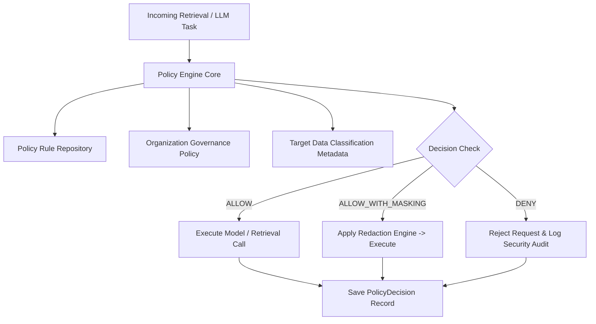

# Finance Intelligence — Data Classification & Exposure Governance Policy

> **Document ID**: `POL-DATA-001`  
> **Status**: `Draft — Pending Phase 0 User Review`  
> **Classification**: `INTERNAL`

---

## 1. Classification Taxonomy & Definitions

Every document, chunk, extracted financial fact, prompt, generated artifact, and audit log record MUST be explicitly tagged with one of five mandatory data sensitivity classes:

1. **`PUBLIC`**: Publicly available regulatory disclosures, published annual reports, public central bank statistics, official gazette notices. No restriction on internal processing.
2. **`INTERNAL`**: Aggregated intra-organization summaries, standard system metric metadata, non-sensitive benchmarking templates. Accessible across organization members.
3. **`CONFIDENTIAL`**: Unreleased quarterly draft financial statements, private institutional comparison working papers, proprietary budget variance models. Restricted to authorized organization roles.
4. **`STRICTLY_CONFIDENTIAL`**: Board-level strategic financial plans, merger/acquisition evaluations, sensitive stress-test projections. Access restricted to explicitly named users; **PROHIBITED from external LLM transmission**.
5. **`PERSONAL_DATA`**: User PII (email, full name, phone number, device identifiers, IP addresses). Subject to KVKK / GDPR compliance; **PROHIBITED from LLM prompt injection and external model training**.

---

## 2. Default Classification Rules

* **Uploaded User Documents**: Default to `CONFIDENTIAL` unless tagged higher by the user or metadata classifier.
* **Extracted Financial Facts**: Inherit the highest classification of their source document version.
* **Calculated Metrics**: Inherit the highest classification of all input facts used in the calculation.
* **User Queries**: Default to `CONFIDENTIAL`.
* **System Logs**: Default to `INTERNAL` with automatic pseudonymization (`user_hash`, `org_hash`) and redaction of `PERSONAL_DATA` fields.

---

## 3. External Model Submission & Policy Enforcement Matrix

The **Policy Engine** evaluates every payload prior to routing to external LLM providers (Anthropic Claude, GCP Vertex AI) or web search providers.

| Data Classification | External LLM Transmission | Vector Embedding Generation | External Web Retrieval Context | Export to File (XLSX/PDF) | Logging / Audit Trace |
|---|---|---|---|---|---|
| **`PUBLIC`** | Allowed (After Auth Check) | Allowed (pgvector) | Allowed (Allowlisted Domains) | Allowed | Pseudonymized Log |
| **`INTERNAL`** | Allowed (Explicit Tenant Opt-in) | Allowed | Restricted (Allowlisted Domains Only) | Allowed | Pseudonymized Log |
| **`CONFIDENTIAL`** | **Default BLOCKED** (Allowed ONLY via Zero-Data-Retention Cloud Provider Agreement) | Allowed (Tenant Isolated Vector Space) | **BLOCKED** | Restricted (Role Authorization Required) | Pseudonymized & Masked Log |
| **`STRICTLY_CONFIDENTIAL`** | **STRICTLY PROHIBITED** | Restricted (Local Self-Hosted Embedding Only) | **STRICTLY PROHIBITED** | Prohibited (Requires Admin Override) | Hash/ID Log Only |
| **`PERSONAL_DATA`** | **STRICTLY PROHIBITED** | **STRICTLY PROHIBITED** | **STRICTLY PROHIBITED** | Prohibited | Masked/Redacted Log |

---

## 4. Policy Engine Decision Architecture

Instead of scattered `if` statements across service modules, all exposure decisions are evaluated through a centralized, audited `PolicyEngine` service.

### Policy Decision Record Schema
Every policy evaluation writes a deterministic audit record to PostgreSQL:
* `policy_decision_id`: UUID
* `tenant_id`: Organization UUID
* `user_id`: User UUID
* `action`: `TRANSMIT_TO_LLM` | `GENERATE_EMBEDDING` | `EXPORT_REPORT` | `WEB_RETRIEVAL`
* `target_classification`: `PUBLIC` | `INTERNAL` | `CONFIDENTIAL` | `STRICTLY_CONFIDENTIAL` | `PERSONAL_DATA`
* `decision`: `ALLOW` | `DENY` | `MASKED_ALLOW`
* `applied_rules`: Array of evaluated rule IDs
* `timestamp`: ISO 8601 UTC

---

## 5. Masking & Redaction Engine Specifications

When processing data tagged as `PERSONAL_DATA` or requiring partial masking under `CONFIDENTIAL` policy:
1. **PII Masking Regex & Named Entity Recognition (NER)**:
   * Turkish TC Kimlik No (TCKN): `\b[1-9][0-9]{10}\b` ➔ `[REDACTED_TCKN]`
   * Email Addresses: `[a-zA-Z0-9._%+-]+@[a-zA-Z0-9.-]+\.[a-zA-Z]{2,}` ➔ `[REDACTED_EMAIL]`
   * IBAN Numbers: `TR[0-9]{2}[0-9]{5}[0-9A-Z]{17}` ➔ `[REDACTED_IBAN]`
   * Phone Numbers: `\+?90[0-9]{10}` ➔ `[REDACTED_PHONE]`
2. **Reversible Tokenization**: For session-bound processing, PII is mapped to ephemeral tokens (`[USER_REF_1]`) stored in Redis memory with 1-hour TTL, preventing raw identity transmission to LLMs.

---

## 6. Retention, Hard Deletion & Legal Hold

* **Standard Document Retention**: Active organization documents are retained while membership remains active.
* **Hard Deletion Workflow**: Upon user or organization request, a background deletion task executes:
  1. Purges original files from Cloud Storage buckets.
  2. Executes `DELETE FROM documents WHERE organization_id = :org_id`.
  3. Purges vector embeddings from `pgvector` index tables.
  4. Flushes Firestore session caches.
* **Legal Hold Exception**: In the event of an active audit or regulatory hold, `AuditEvent` records and file hashes are preserved in an append-only archive table with original file contents rendered inaccessible to normal application queries.
