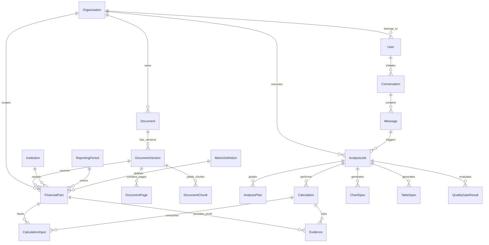

# Finance Intelligence — Master Data Model & Entity Specification

> **Document ID**: `DAT-FIN-001`  
> **Status**: `Draft — Pending Phase 0 User Review`  
> **Classification**: `INTERNAL`

---

## 1. High-Level Entity Relationship Diagram (ERD)



---

## 2. Storage Placement & Source-of-Truth Split

| Data Store | Target Entities | Rationale & Responsibilities |
|---|---|---|
| **PostgreSQL 16** (Cloud SQL Proposed Baseline) | `Organization`, `User`, `Membership`, `Role`, `Document`, `DocumentVersion`, `DocumentPage`, `DocumentChunk`, `Source`, `Institution`, `ReportingPeriod`, `MetricDefinition`, `FinancialFact`, `FinancialStatement`, `Regulation`, `RegulationVersion`, `Evidence`, `Calculation`, `CalculationInput`, `AuditEvent`, `ModelInvocation`, `ToolInvocation`, `PolicyDecision`, `QualityGateResult`, `DataIssue`, `ExportJob` | Canonical relational source-of-truth. Provides ACID transactional properties, multi-tier Decimal financial arithmetic, complex joins, PostgreSQL Row-Level Security (RLS) tenant isolation, and vector similarity search via `pgvector`. |
| **Cloud Firestore** | `Conversation`, `Message`, `AnalysisJob` (transient status sync), Mobile Session State | Real-time websocket/listener sync for mobile clients, high-concurrency low-latency chat UI history, and live progress state indicators. |
| **Cloud Storage (GCS)** | Raw PDF/XLSX/CSV documents, generated PNG charts, exported XLSX/PDF reports | Immutable blob storage encrypted with customer-managed KMS keys. |

---

## 3. Financial Precision & Multi-Tier Storage Specification

### 3.1 Why Binary Floating-Point (`FLOAT` / `DOUBLE`) is STRICTLY PROHIBITED
Binary floating-point arithmetic (IEEE 754) cannot accurately represent base-10 fractional financial numbers (e.g. `0.1 + 0.2 != 0.3`). In financial reporting across billions of currency units, binary floating-point representation errors cause balance sheet reconciliation failures.

### 3.2 Precision Tiers
1. **Source Value Precision**: Raw string as originally reported (e.g. `"2.850.000.000 Bin TL"`).
2. **Normalized Storage Precision**: `NUMERIC(28, 6)` (`Proposed`) in PostgreSQL.
3. **Calculation Working Precision**: `decimal.Decimal` in Python memory during formula execution (working context precision `prec = 38` significant digits).
4. **Percentage / Ratio Precision**: Result quantization via `quantize(Decimal('0.0001'))` (supporting 0.0001% / 4 decimal place precision).
5. **FX Rate Precision**: Result quantization via `quantize(Decimal('0.00000001'))` (supporting up to 8 decimal place exchange rate precision).
6. **Display Precision**: Presentation formatting linked to metric definition type (currency, %, ratio, FX rate, count).
7. **Rounding Rules**: Governed by metric/formula definition versioning rules (e.g. `ROUND_HALF_UP` applied at metric boundary output stage only).

---

## 4. Master Entity Catalog (33 Core Entities) & RLS Policy Schema

### 4.1 Organization, User & PostgreSQL Row-Level Security (RLS)

```sql
-- Enable Row-Level Security (RLS) on all tenant tables
ALTER TABLE documents ENABLE ROW LEVEL SECURITY;
ALTER TABLE financial_facts ENABLE ROW LEVEL SECURITY;
ALTER TABLE analysis_jobs ENABLE ROW LEVEL SECURITY;

-- Force RLS even for table owners
ALTER TABLE documents FORCE ROW LEVEL SECURITY;
ALTER TABLE financial_facts FORCE ROW LEVEL SECURITY;
ALTER TABLE analysis_jobs FORCE ROW LEVEL SECURITY;

-- Primary Tenant Isolation RLS Policy (app.current_organization_id)
CREATE POLICY tenant_isolation_policy ON financial_facts
    FOR ALL
    TO db_app_user
    USING (organization_id = NULLIF(current_setting('app.current_organization_id', true), '')::uuid)
    WITH CHECK (organization_id = NULLIF(current_setting('app.current_organization_id', true), '')::uuid);
```

### 4.2 Document & Version Hierarchy

```sql
CREATE TABLE documents (
    id UUID PRIMARY KEY DEFAULT gen_random_uuid(),
    organization_id UUID NOT NULL REFERENCES organizations(id) ON DELETE CASCADE,
    title VARCHAR(512) NOT NULL,
    file_type VARCHAR(20) NOT NULL CHECK (file_type IN ('PDF', 'XLSX', 'CSV', 'DOCX')),
    original_filename VARCHAR(512) NOT NULL,
    data_classification VARCHAR(50) NOT NULL DEFAULT 'CONFIDENTIAL',
    created_at TIMESTAMPTZ NOT NULL DEFAULT NOW()
);

CREATE TABLE document_versions (
    id UUID PRIMARY KEY DEFAULT gen_random_uuid(),
    document_id UUID NOT NULL REFERENCES documents(id) ON DELETE CASCADE,
    version_number INT NOT NULL DEFAULT 1,
    sha256_hash CHAR(64) NOT NULL, -- Computed server-side upon upload completion
    gcs_object_path VARCHAR(1024) NOT NULL,
    file_size_bytes BIGINT NOT NULL,
    extraction_status VARCHAR(50) NOT NULL DEFAULT 'PENDING',
    ocr_applied BOOLEAN NOT NULL DEFAULT FALSE,
    created_at TIMESTAMPTZ NOT NULL DEFAULT NOW(),
    UNIQUE(document_id, version_number)
);
```

### 4.3 Financial Fact Core

```sql
CREATE TABLE financial_facts (
    id UUID PRIMARY KEY DEFAULT gen_random_uuid(),
    organization_id UUID NOT NULL REFERENCES organizations(id) ON DELETE CASCADE,
    institution_id UUID NOT NULL REFERENCES institutions(id),
    reporting_period_id UUID NOT NULL REFERENCES reporting_periods(id),
    metric_definition_id UUID NOT NULL REFERENCES metric_definitions(id),
    
    -- Raw Original Values
    value VARCHAR(100) NOT NULL,
    currency VARCHAR(10) NOT NULL,
    unit VARCHAR(20) NOT NULL,
    scale INT NOT NULL DEFAULT 0,
    
    -- Normalized Exact Values
    normalized_value NUMERIC(28, 6) NOT NULL,
    normalized_currency VARCHAR(10) NOT NULL DEFAULT 'TRY',
    normalized_unit VARCHAR(20) NOT NULL DEFAULT 'TRY',
    reporting_basis VARCHAR(50) NOT NULL DEFAULT 'CONSOLIDATED',
    
    -- Lineage & Provenance
    source_document_id UUID REFERENCES documents(id),
    source_document_version_id UUID REFERENCES document_versions(id),
    source_page INT,
    source_table VARCHAR(255),
    source_cell_or_row VARCHAR(255),
    extraction_method VARCHAR(50) NOT NULL,
    confidence_score NUMERIC(5, 4) NOT NULL CHECK (confidence_score BETWEEN 0 AND 1),
    review_status VARCHAR(50) NOT NULL DEFAULT 'UNREVIEWED' CHECK (review_status IN ('UNREVIEWED', 'AUTO_VERIFIED', 'HUMAN_VERIFIED', 'FLAGGED_CONFLICT')),
    data_classification VARCHAR(50) NOT NULL DEFAULT 'CONFIDENTIAL',
    lineage_metadata JSONB,
    
    created_at TIMESTAMPTZ NOT NULL DEFAULT NOW(),
    updated_at TIMESTAMPTZ NOT NULL DEFAULT NOW(),
    
    CONSTRAINT unique_fact_instance UNIQUE (organization_id, institution_id, reporting_period_id, metric_definition_id, reporting_basis)
);
```

### 4.4 Result Dataset, Table & Chart Linkage (`result_dataset_id`)

To ensure `TableSpec` and `ChartSpec` derive strictly from the exact same underlying canonical data:

```sql
CREATE TABLE table_specs (
    id UUID PRIMARY KEY DEFAULT gen_random_uuid(),
    analysis_job_id UUID NOT NULL REFERENCES analysis_jobs(id) ON DELETE CASCADE,
    result_dataset_id UUID NOT NULL, -- Mandated binding key between TableSpec and ChartSpec
    title VARCHAR(512) NOT NULL,
    table_data JSONB NOT NULL,
    created_at TIMESTAMPTZ NOT NULL DEFAULT NOW()
);

CREATE TABLE chart_specs (
    id UUID PRIMARY KEY DEFAULT gen_random_uuid(),
    analysis_job_id UUID NOT NULL REFERENCES analysis_jobs(id) ON DELETE CASCADE,
    result_dataset_id UUID NOT NULL, -- Mandated binding key matching TableSpec
    chart_type VARCHAR(50) NOT NULL,
    title VARCHAR(512) NOT NULL,
    spec_data JSONB NOT NULL,
    created_at TIMESTAMPTZ NOT NULL DEFAULT NOW()
);
```

### 4.5 Calculation Lineage & Ratio Lineage (`CalculationInput`)

```sql
CREATE TABLE calculation_inputs (
    id UUID PRIMARY KEY DEFAULT gen_random_uuid(),
    calculation_id UUID NOT NULL REFERENCES calculations(id) ON DELETE CASCADE,
    input_fact_id UUID REFERENCES financial_facts(id),
    input_role VARCHAR(50) NOT NULL, -- 'NUMERATOR', 'DENOMINATOR', 'BASE_VALUE', etc.
    input_value NUMERIC(28, 6) NOT NULL
);
```

### 4.6 Audit Log Tamper-Evidence Note

`AuditEvent` logs enforce append-only insertion with SHA-256 hash chaining (`previous_hash` + `event_payload` ➔ `current_hash`). Hash chaining provides **tamper evidence** (detecting unauthorized modification of past log rows), but does not constitute physical immutability (which requires WORM storage hardware policy locks).
