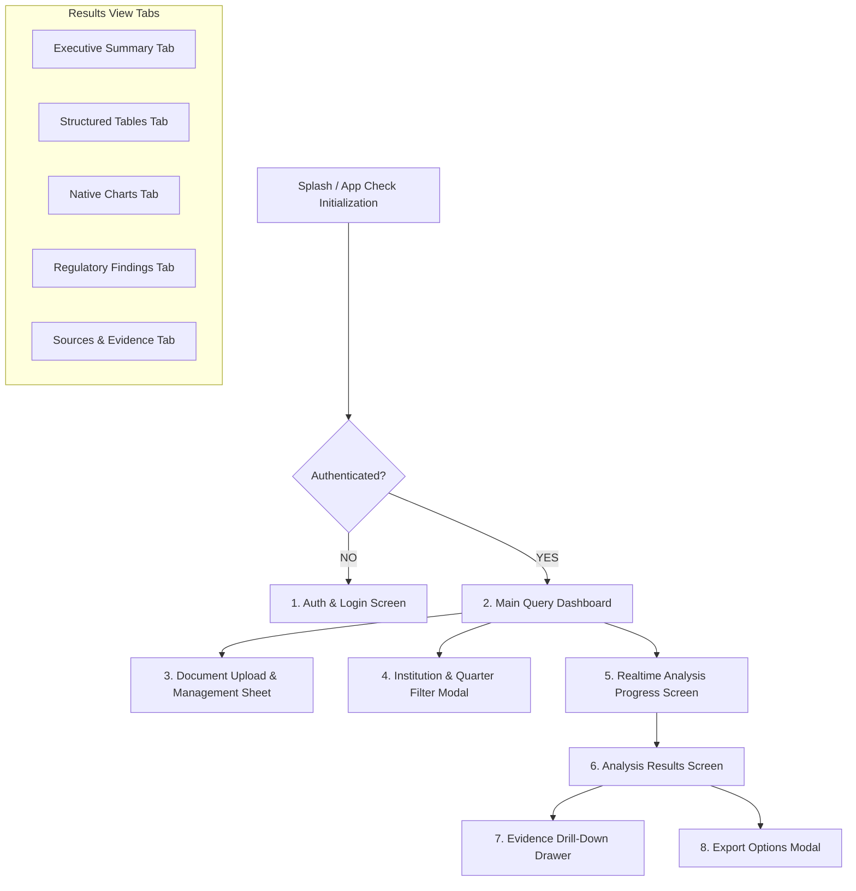

# Finance Intelligence — Mobile Client Architecture & UX Wireflows

> **Document ID**: `MOB-FIN-001`  
> **Status**: `Draft — Pending Phase 0 User Review`  
> **Target Framework**: `Flutter 3.x / Dart 3.x (Proposed)`  
> **State Management**: `Riverpod 2.x (Proposed)`  
> **Classification**: `INTERNAL`

---

## 1. Application Screen Hierarchy & Routing



---

## 2. Dynamic Chart Rendering Engine (Client-Side)

### 2.1 Why Charts Are Rendered Natively on Client
LLMs DO NOT draw pixels or generate binary chart images directly. The backend orchestrator generates a validated `ChartSpec` JSON payload bound to a `result_dataset_id`. The Flutter client renders this payload using Flutter chart widgets (`fl_chart` / `syncfusion_flutter_charts`).

### 2.2 Supported Chart Types & Formatting Constraints
* **`horizontal_bar`**: Metric rankings across 5+ institutions.
* **`vertical_bar`**: Single-institution multi-quarter progression.
* **`grouped_bar`**: Multi-institution 2-4 item peer comparison.
* **`line`**: 4+ quarter historical trend analysis.
* **`stacked_bar`**: Balance sheet component breakdown.
* **`pie`**: **Restricted Usage Policy**: Pie charts are restricted strictly to composition metrics adding up to exactly 100% (e.g. Demand vs Time Deposits). Prohibited for non-part-to-whole comparisons.

---

## 3. Screen Wireflows & Interaction Specifications

### 3.1 Main Query Screen Layout (ASCII Wireflow)

```text
+-------------------------------------------------------------+
|  Finance Intelligence                              [User Avatar] |
|                                                                 |
|  [ Attached Files (1) ]  [ Filter: GARAN, AKBNK | 2025/Q4 v ]    |
|                                                                 |
|  +-----------------------------------------------------------+  |
|  | Türkiye'de aktif büyüklüğüne göre ilk iki bankayı         |  |
|  | son çeyrek itibarıyla karşılaştır ve sermaye              |  |
|  | yeterlilik oranlarını rasyo ve grafikle göster.           |  |
|  |                                                           |  |
|  |                                      [ + File ] [ Submit ] |  |
|  +-----------------------------------------------------------+  |
|                                                                 |
|  Recent Analyses                                                |
|  * GARAN vs AKBNK 2025/Q4 Peer Comparison    [Completed  >]     |
|  * Budget Variance Analysis - Internal PDF   [Completed  >]     |
+-------------------------------------------------------------+
```

### 3.2 Evidence Drill-Down Drawer (ASCII Wireflow)

```text
+-------------------------------------------------------------+
|  < Back     Evidence Verification [EIV-001]                     |
+-------------------------------------------------------------+
|  Source File : GARAN_Q4_2025_FR.pdf                             |
|  Page        : Page 42 (Table 3.1: Bilanço Aktif Kalemleri)     |
|  Coordinate  : Row 14, Column 3                                 |
|  Confidence  : 99.8% (Auto-Verified)                            |
+-------------------------------------------------------------+
|  Document Page Preview:                                         |
|  +-------------------------------------------------------+  |
|  |  Kalemler               2025/Q4 (Bin TL)  2024/Q4       |  |
|  |  --------------------------------------------------   |  |
|  | [ Toplam Aktifler       2.850.000.000 ] <HIGHLIGHTED> |  |
|  |  Krediler               1.720.000.000                 |  |
|  +-------------------------------------------------------+  |
+-------------------------------------------------------------+
```

---

## 4. Accessibility (a11y) & Network Resilience

1. **Touch Targets & Contrast**: Target 48x48 dp touch target bounds for interactive chips, buttons, and drawer triggers. Target 4.5:1 color contrast ratio across light/dark themes.
2. **Screen Reader Semantics**: Table cells and chart elements expose `Semantics(label: "GARAN 2025 Q4 Toplam Aktifler: 2 Trilyon 850 Milyar TL, Kaynak Sayfa 42")`.
3. **Poor Network Handling**: Offline caching preserves offline access to previously retrieved analysis reports. Stream connection drops automatically attempt SSE reconnects with exponential backoff.
