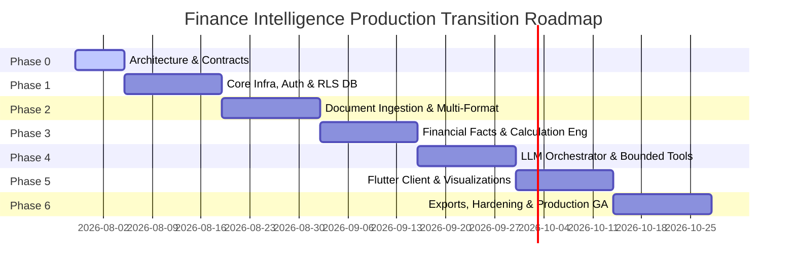

# Finance Intelligence — Phased Implementation & Transition Roadmap

> **Document ID**: `IMP-FIN-001`  
> **Status**: `Draft — Pending Phase 0 User Review`  
> **Classification**: `INTERNAL`

---

## 1. Multi-Phase Engineering Roadmap Summary

---

## 2. Phase-by-Phase Execution Specifications

### Phase 0: Architecture, Design & Contracts (Current Phase)
* **Goal**: Establish architecture backbone, security threat model, data classification rules, and API/tool contracts without creating application code.
* **Entry Criteria**: Product prompt received.
* **Exit Criteria**: All 20 main architecture docs and 10 ADRs written, updated for consistency, and verified against PRD requirements. Zero source code generated.
* **Dependencies**: None.
* **Deliverables**: `docs/*.md`, `docs/adr/*.md`, `.env.example`.
* **Rollback Plan**: Revert doc changes if architecture review flags unresolved conflicts.

### Phase 1: Core Foundation, Security & Multi-Tenant RLS DB
* **Goal**: Provision Cloud Run services, Cloud SQL PostgreSQL with Row-Level Security (RLS using `app.current_organization_id`) policies, Firestore, Firebase Auth, App Check, and ExecutionContext middleware.
* **Entry Criteria**: Phase 0 signed off by user.
* **Exit Criteria**: Health check endpoints returning HTTP 200 OK; Firebase ID Token & App Check validation passing clean on Cloud Run staging; RLS negative security tests passing.
* **Dependencies**: GCP Project provisioned, Firebase project linked, Legal/Compliance signoff on data region.
* **Deliverables**: Monorepo scaffolding, FastAPI router, DB migrations (`001_initial_schema.py`), RLS policies, Auth middleware.
* **Rollback Plan**: Terraform destroy / deployment rollback to baseline empty GCP project.

### Phase 2: Document Ingestion & Multi-Format Parsing Pipeline
* **Goal**: Build async ingestion worker, GCS signed upload flow with server-side SHA-256 hash calculation, candidate PDF/XLSX layout parsers, OCR fallback, and chunking pipeline.
* **Entry Criteria**: Phase 1 DB & Storage active.
* **Exit Criteria**: Uploading quarterly banking filings yields structured table extractions evaluated against golden-document benchmarks with confidence scoring.
* **Dependencies**: Phase 1 Storage buckets and DB tables.
* **Deliverables**: `services/worker/ingestion`, parser candidate evaluation harness.
* **Rollback Plan**: Disable document processing feature flag `ENABLE_DOC_INGESTION`.

### Phase 3: Financial Fact Store & Calculation Engine
* **Goal**: Implement PostgreSQL `financial_facts` store, multi-tier Decimal arithmetic engine, and Formula Registry for 11 MVP metrics.
* **Entry Criteria**: Phase 2 ingestion baseline active.
* **Exit Criteria**: Pass rate on golden Excel model property-based test suite across CAR, ROA, ROE, LDR, NIM metrics.
* **Dependencies**: Phase 2 extracted table structures.
* **Deliverables**: `packages/financial-domain`, pure Python formula registry, unit test suite.
* **Rollback Plan**: Revert formula registry version to prior validated commit.

### Phase 4: LLM Orchestrator, Bounded Tools & Quality Gates
* **Goal**: Implement FSM agent orchestrator, capability-matrix provider adapter, 14 bounded tools (zero LLM tenant args), regulatory placeholder adapter, and Quality Gate verification engine.
* **Entry Criteria**: Phase 3 Calculation Engine verified.
* **Exit Criteria**: Query execution completes via bounded tool calls with verified evidence citations; regulatory tool returns safe `REGULATORY_DATA_UNAVAILABLE` error in MVP.
* **Dependencies**: Phase 3 facts & calculations.
* **Deliverables**: `services/api/orchestration`, 14 tool handlers, prompt injection benchmarks.
* **Rollback Plan**: Fallback to direct calculation query API without LLM analytical summary step.

### Phase 5: Flutter Mobile Client & Native Visualization
* **Goal**: Build Flutter cross-platform mobile client (proposed target), Riverpod state controllers, dynamic `ChartSpec` native renderer bound to `result_dataset_id`, and evidence drawer.
* **Entry Criteria**: Phase 4 backend APIs active on staging.
* **Exit Criteria**: Mobile app successfully runs full query flow, rendering interactive bar/line charts and evidence drill-down drawer.
* **Dependencies**: Phase 4 API endpoints.
* **Deliverables**: `apps/mobile` Flutter codebase, iOS/Android builds.
* **Rollback Plan**: Fallback mobile client build pointing to previous API version target.

### Phase 6: Report Export, Hardening & Production GA
* **Goal**: Implement XLSX/CSV report generator, complete security penetration testing, execute load tests, and release MVP.
* **Entry Criteria**: Phase 5 mobile integration complete.
* **Exit Criteria**: Zero high-severity vulnerabilities in pen test; P95 API latency < 300ms @ 100 RPS; production launch signoff.
* **Dependencies**: Phase 5 client & backend.
* **Deliverables**: Production deployment artifacts, release notes, user documentation.
* **Rollback Plan**: Cloud Run revision traffic splitting rollback to pre-release deployment.
