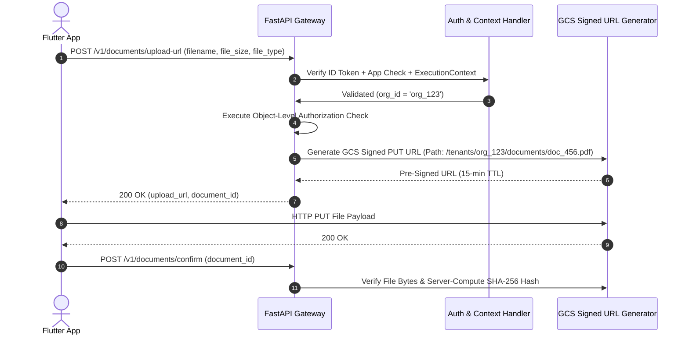

# Finance Intelligence — Security & Threat Model

> **Document ID**: `SEC-FIN-001`  
> **Status**: `Draft — Pending Phase 0 User Review`  
> **Framework**: `STRIDE + OWASP Top 10 for LLM Applications (2025)`  
> **Classification**: `CONFIDENTIAL`

---

## 1. System Assets & Actor Matrix

### 1.1 Assets
1. **Financial Fact Database**: Normalized financial facts, balance sheets, and institutional performance metrics (`CONFIDENTIAL` / `INTERNAL`).
2. **User Documents**: Uploaded quarterly PDF reports, XLSX spreadsheets, and CSV filings (`CONFIDENTIAL` / `STRICTLY_CONFIDENTIAL`).
3. **Audit Trail Logs**: Tamper-evident record of user actions, policy decisions, and calculation inputs (`CONFIDENTIAL`).
4. **API & LLM Credentials**: Anthropic API keys, Firebase service account keys, GCP database passwords (`STRICTLY_CONFIDENTIAL`).
5. **System Availability & Compute Budget**: Cloud Run execution quota, LLM token budget, Cloud SQL connections.

### 1.2 Actors
* **Anonymous User**: Unauthenticated request actor. Denied all access except public auth landing.
* **Authenticated End User**: Authenticated mobile user bound to an `Organization`.
* **Organization Administrator**: Tenant manager with user role assignment privileges.
* **Malicious External Actor**: Attacker attempting prompt injection, SSRF, BOLA/IDOR, or credential theft.
* **Malicious Internal / Compromised File**: Untrusted document containing indirect prompt injection payload.

---

## 2. Trust Boundaries & Defense-in-Depth Entry Points

```
[Untrusted Public Internet]
        │
        ▼ (Entry Point 1: HTTPS REST / SSE API)
[Edge Auth Boundary: Firebase Auth + Firebase App Check]
        │
        ▼ (Entry Point 2: Server-Authorized Signed GCS Upload URLs)
[Gateway / Control Plane: FastAPI + ExecutionContext + Policy Engine]
        │
        ▼ (Entry Point 3: PostgreSQL Row-Level Security Primary Boundary - app.current_organization_id)
[Processing Plane: Ingestion Workers & Decimal Calculation Engine]
        │
        ▼ (Entry Point 4: Outbound Web Retrieval & LLM APIs)
[External LLM Providers & Allowlisted Web Domain Targets]
```

---

## 3. STRIDE Threat Matrix & Defense-in-Depth Controls

| Threat ID | STRIDE Category | Target Component | Threat Description | Impact | Likelihood | Mitigating Security Controls | Residual Risk |
|---|---|---|---|---|---|---|---|
| `THR-001` | **Spoofing** | API Gateway | Attacker crafts synthetic API calls impersonating valid mobile clients. | High | Medium | Enforce **Firebase App Check** token validation alongside **Firebase Auth ID Tokens**. Replay window < 5 min. | Low residual risk (device compromise possible). |
| `THR-002` | **Tampering** | File Upload Stream | Attacker uploads modified PDF or spoofed checksum claim. | High | Low | Server computes **SHA-256 hash** upon upload completion; enforces magic byte MIME validation and GCS object locks. | Low residual risk. |
| `THR-003` | **Repudiation** | Calculation Engine | User disputes calculation lineage. | Medium | Low | Append-only `AuditEvent` log with cryptographic hash chain mapping `User` -> `Job` -> `Inputs` -> `Calculations`. Provides tamper evidence (not physical immutability). | Low residual risk. |
| `THR-004` | **Information Disclosure** | Multi-tenant DB | User from Org A accesses financial facts or uploaded documents of Org B (BOLA/IDOR). | Critical | Medium | **Defense-in-Depth**: PostgreSQL Row-Level Security (RLS) policies using `app.current_organization_id`, runtime role segregation (`db_app_user` with `NOBYPASSRLS` and `FORCE RLS`), pool context reset, GCS path isolation, and object-level pre-authorization (`SEC-005`). | Low residual risk (misconfigured RLS policy). |
| `THR-005` | **Denial of Service** | Ingestion Worker | Attacker uploads a 1MB ZIP/PDF decompression bomb expanding to 100GB in memory. | High | Medium | Strict pre-upload MIME validation, file size limit (50MB), Cloud Run memory allocation caps (2GB), and streaming decompression bounds (max 20:1 ratio). | Low residual risk. |
| `THR-006` | **Elevation of Privilege** | LLM Agent Orchestrator | Indirect Prompt Injection inside uploaded PDF attempts to command LLM to bypass policy. | Critical | High | Bounded Tool JSON Schemas (zero LLM tenant args - `SEC-008`); XML tag context isolation; input sanitization; system prompt segregation; code execution disabled. | Medium residual risk (novel jailbreak patterns). |
| `THR-007` | **Information Disclosure** | Web Retrieval Tool | Attacker forces `fetch_official_document` tool to make SSRF calls to internal GCP metadata servers (`169.254.169.254`). | Critical | High | URL canonicalization, domain allowlist enforcement, DNS pre-resolution blocking private IP ranges (RFC 1918/6598), max 3 redirects. | Low residual risk. |
| `THR-008` | **Information Disclosure** | Export Worker | User exports data containing `CONFIDENTIAL` metrics without authorization. | High | Medium | Pre-export evaluation via `PolicyEngine` validating tenant export permissions and applying cell masking. | Low residual risk. |
| `THR-009` | **Denial of Service** | Model Provider Call | Infinite loop in agent tool invocation drains token budget. | High | Medium | Hard cap on max tool steps per job (max 8 steps), timeout per tool call, per-user daily token caps, and emergency kill switches. | Low residual risk. |
| `THR-010` | **Tampering** | Export Spreadsheet | CSV/XLSX export contains malicious formula strings (`=CMD|' /C calc'!A0`). | Medium | Medium | CSV/Excel formula injection sanitizer escaping all fields starting with `=`, `+`, `-`, `@`, `0x09`, `0x0D`. | Low residual risk. |

---

## 4. Specialized Security Controls

### 4.1 Server-Injected Execution Context & LLM Tool Security (`SEC-008`)
To eliminate BOLA/IDOR risks driven by LLM hallucination or prompt injection:
1. **Zero Client/LLM Tenant Arguments**: LLM tool JSON schemas MUST NOT contain `organization_id`, `tenant_id`, or `user_id` fields.
2. **Backend Execution Context**: The backend constructs an immutable `ExecutionContext` upon request authentication (`authenticated_user_id`, `active_organization_id`, `roles`, `permissions`).
3. **Fail-Closed Authorization**: Every tool handler executes pre-authorization checks enforcing `ExecutionContext` bounds prior to database or storage operations.

### 4.2 Logging Pseudonymization & Data Minimization
To comply with KVKK / GDPR data minimization principles:
* Raw `user_id` and `organization_id` values in application logs are pseudonymized using SHA-256 HMAC tokens (`user_hash`, `org_hash`).
* Raw PII fields (emails, names, phone numbers) are masked before writing to log sinks.

### 4.3 Web Retrieval & SSRF Mitigation
The `search_public_sources` and `fetch_official_document` tools enforce multi-layered SSRF defenses:
1. **Domain Allowlist**: Only explicitly allowed domains can be queried (`kap.org.tr`, `tcmb.gov.tr`, `bddk.org.tr`, `resmigazete.gov.tr`).
2. **DNS Resolution Verification**: Prior to HTTP connection, target IPs are resolved and checked against private/link-local ranges (`10.0.0.0/8`, `172.16.0.0/12`, `192.168.0.0/16`, `127.0.0.0/8`, `169.254.0.0/16`).
3. **Scheme Restrictions**: Rejection of `file://`, `gcs://`, `ftp://`, or `dict://` schemes.

---

## 5. Signed URL & Object-Level Authorization Flow



---

## 6. Incident Response Requirements

* **Automated Session Revocation**: Detection of > 5 failed App Check attestations or unauthorized cross-tenant attempts automatically revokes the user session.
* **Emergency Kill-Switches**: Feature flags (`DISABLE_EXTERNAL_LLM_RETRIEVAL`, `FORCE_DETERMINISTIC_ONLY`) allow immediate shutdown of external network calls.
* **Key Rotation**: Database credentials and KMS encryption keys are rotated periodically via GCP Secret Manager.
