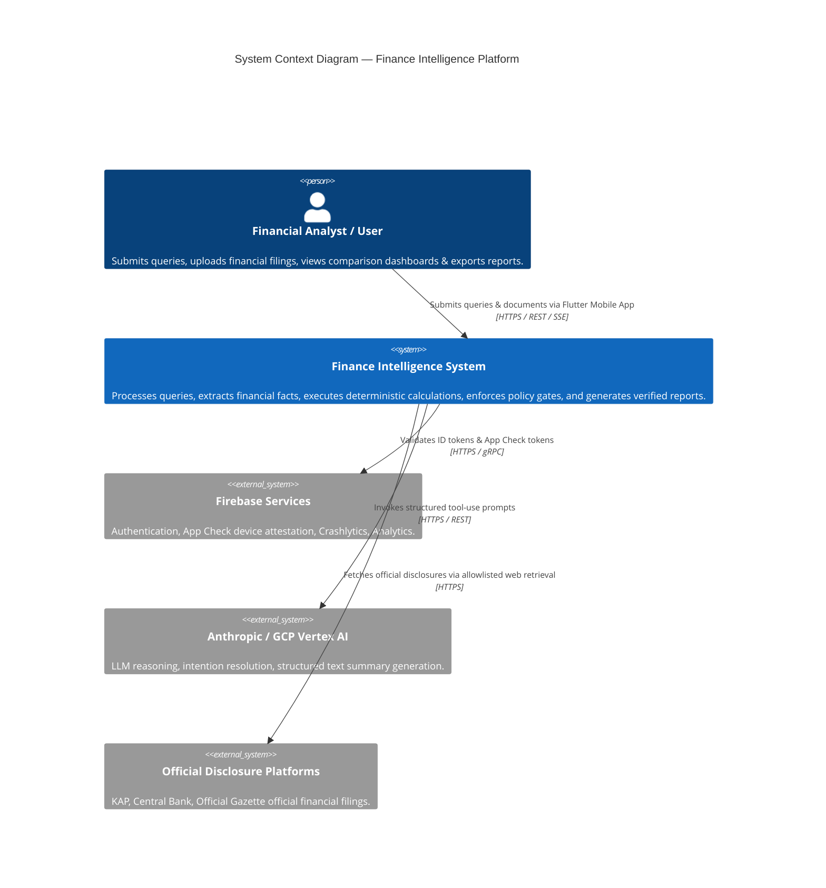
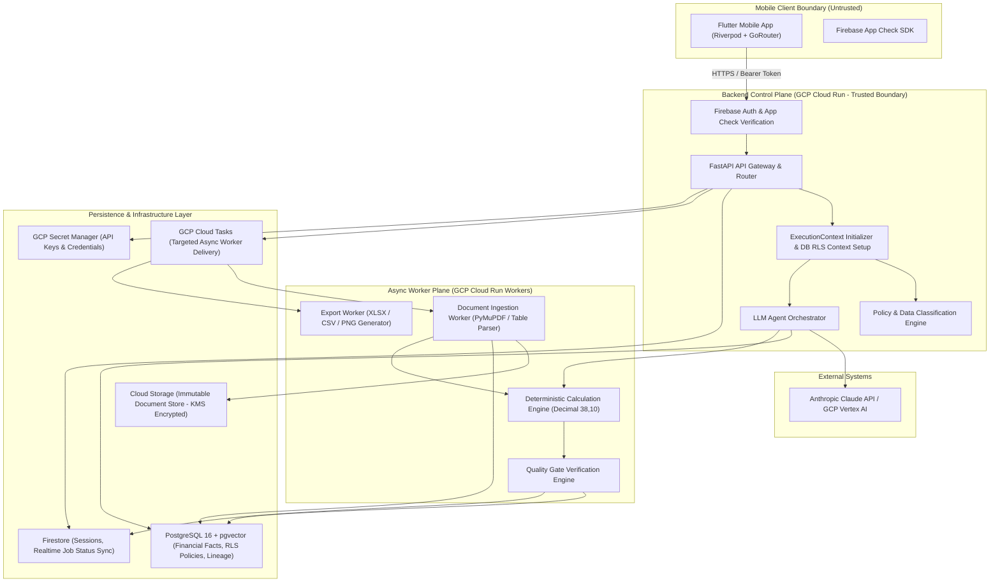
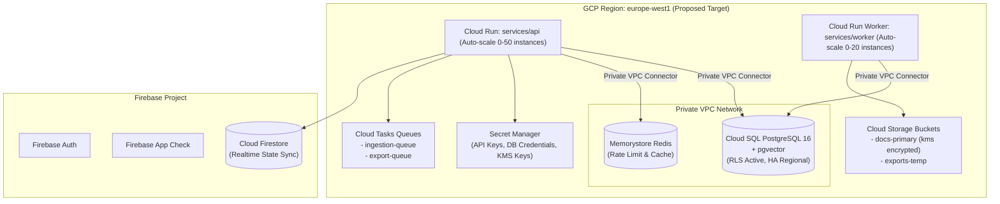

# Finance Intelligence — System Architecture Specification

> **Document ID**: `ARCH-FIN-001`  
> **Status**: `Draft — Pending Phase 0 User Review`  
> **Classification**: `INTERNAL`

---

## 1. Architecture Summary

**Finance Intelligence** is built as a cloud-native, decoupled platform. The architecture separates the mobile client (presentation), API Gateway / Orchestrator (control plane), Ingestion & Calculation Engine (deterministic domain layer), and LLM / Vector Search Services (cognition & retrieval).

Key Architectural Foundations:
* **Mobile Client (Proposed)**: Flutter cross-platform app utilizing Riverpod state management and native dynamic visualizers.
* **API Gateway & FastAPI Backend**: Python 3.12, FastAPI, Pydantic v2, SQLAlchemy 2, running on Google Cloud Run.
* **Dual Database Backbone**:
  * **PostgreSQL + pgvector**: Canonical source-of-truth for normalized financial facts, document structures, calculation schemas, evidence lineage, and vector embeddings. Enforces **PostgreSQL Row-Level Security (RLS using `app.current_organization_id`)** as the primary tenant isolation boundary.
  * **Firestore**: Operational database for mobile state sync, real-time job progress listeners, user chat sessions, and transient notification states.
* **Async Workers & Event Bus**:
  * **GCP Cloud Tasks**: Targeted background HTTP command delivery, rate control, and retries (e.g. PDF parsing, table extraction, report exports).
  * **GCP Pub/Sub**: Reserved for multi-consumer event broadcasting when multiple background services consume the same domain event.
  * **Cloud Run Jobs / Batch**: Reserved for Phase 6+ long-running batch operations exceeding HTTP request timeouts.

---

## 2. System Context Diagram (C4 Level 1)



---

## 3. Container & Component Diagram (C4 Level 2)



---

## 4. Defense-in-Depth Tenant Isolation Architecture

Multi-tenant isolation is enforced across 11 defense-in-depth security layers:

```
[Layer 1: Edge Authentication & App Check Attestation]
        │
[Layer 2: Server-Injected ExecutionContext (No LLM Tenant Args)]
        │
[Layer 3: Pre-Signed URL Pre-Authorization & Path Checking]
        │
[Layer 4: PostgreSQL Row-Level Security (RLS) Primary Boundary]
        │
[Layer 5: Transaction-Scoped RLS Context (`SET LOCAL app.current_organization_id`)]
        │
[Layer 6: Connection Pool Cleanup (`RESET app.current_organization_id` on Checkout/Checkin)]
        │
[Layer 7: Database Role Separation (`db_app_user` with NOBYPASSRLS + FORCE RLS)]
        │
[Layer 8: Composite Keys & Foreign Key Tenant Constraints]
        │
[Layer 9: Raw SQL & Worker Task RLS Execution Wrapper]
        │
[Layer 10: Firestore Security Rules Tenant Scope]
        │
[Layer 11: Automated Cross-Tenant Negative Integration Tests]
```

1. **Primary Security Boundary**: PostgreSQL Row-Level Security (RLS) policies are active on all tenant tables (`CREATE POLICY tenant_isolation_policy ON ... USING (organization_id = NULLIF(current_setting('app.current_organization_id', true), '')::uuid)`). Table owners are forced to comply via `ALTER TABLE ... FORCE ROW LEVEL SECURITY`.
2. **Fail-Closed Context**: If `app.current_organization_id` is missing or empty, queries return zero rows (fail-closed).
3. **Runtime Role Isolation**: Application database role `db_app_user` possesses `NOBYPASSRLS` privileges. Migration role `db_owner` is isolated from runtime application pools.
4. **Connection Pool Hygiene**: DB connection checkout/checkin hooks execute `RESET app.current_organization_id` to prevent session context bleeding across pooled connections.

---

## 5. End-to-End Analysis Sequence Diagram

```mermaid
sequenceDiagram
    autonumber
    actor User as User (Flutter App)
    participant GW as FastAPI Gateway
    participant PE as Policy Engine
    participant FS as Firestore (Job Status)
    participant Task as GCP Cloud Tasks
    participant Orchestrator as LLM Orchestrator
    participant Tool as Query/Calc Tool
    participant Calc as Calculation Engine
    participant PG as PostgreSQL (RLS Active)
    participant Gate as Quality Gate Engine
    participant LLM as Anthropic Claude API

    User->>GW: POST /v1/analysis/jobs (query, document_ids) [Bearer + App Check]
    GW->>GW: Construct ExecutionContext (Server-injected org_id)
    GW->>PE: Evaluate Request Permissions & Data Policy
    PE-->>GW: Policy Approved
    GW->>PG: SET LOCAL app.current_organization_id = :org_id; INSERT AnalysisJob (status='queued')
    GW->>FS: Init Job Document (status='queued')
    GW->>Task: Dispatch Async Job Task
    GW-->>User: 202 Accepted (job_id, sse_stream_url)

    activate Task
    Task->>Orchestrator: Execute Analysis Job (job_id, ExecutionContext)
    Orchestrator->>FS: Update status = 'retrieving'
    Orchestrator->>Tool: Execute query_financial_facts(institution_codes, metric_codes) [No org_id in LLM args]
    Tool->>PG: SELECT normalized facts (RLS enforces app.current_organization_id)
    PG-->>Tool: Return canonical facts & evidence links
    
    Orchestrator->>FS: Update status = 'calculating'
    Orchestrator->>Calc: Execute calculate_financial_metrics(inputs, formula_v1)
    Calc-->>Orchestrator: Return deterministic calculated metrics

    Orchestrator->>FS: Update status = 'validating'
    Orchestrator->>Gate: Execute Quality Gate Suite
    Gate-->>Orchestrator: Gate Passed (Evidence & decimal precision verified)

    Orchestrator->>LLM: Generate Analytical Summary (Structured Facts + Context)
    LLM-->>Orchestrator: Return Structured Interpretation

    Orchestrator->>PG: Save Canonical Result (TableSpec, ChartSpec tied to result_dataset_id)
    Orchestrator->>FS: Update status = 'completed'
    FS-->>User: SSE Event: status='completed', payload_ready=true
    deactivate Task

    User->>GW: GET /v1/analysis/jobs/{job_id}/result
    GW->>PG: Fetch Canonical Result
    PG-->>GW: Result Payload
    GW-->>User: 200 OK (ExecutiveSummary, TableSpec, ChartSpec, Evidence)
```

---

## 6. Monorepo Tree Architecture Proposal

```
finance-intelligence/
├── apps/
│   └── mobile/                       # Flutter Mobile Application (Proposed)
│       ├── lib/
│       │   ├── core/                 # Auth, Theme, Router, Network (Dio)
│       │   ├── features/             # Query, Documents, Analysis, Charts, Evidence
│       │   └── main.dart
│       ├── pubspec.yaml
│       └── ios/ & android/
├── services/
│   ├── api/                          # FastAPI Control Plane & Gateway
│   │   ├── src/
│   │   │   ├── api/                  # REST Endpoint Handlers & Routes
│   │   │   ├── core/                 # Config, Security, Firebase Middleware
│   │   │   ├── services/             # Policy Engine, Storage, Orchestration
│   │   │   └── main.py
│   │   ├── Dockerfile
│   │   └── requirements.txt
│   └── worker/                       # Async Processing & Extraction Worker
│       ├── src/
│       │   ├── ingestion/            # PDF/XLSX Parser, OCR Fallback, Chunking
│       │   ├── calculation/          # Deterministic Metric Engine
│       │   └── export/               # Report Generator (Excel/PNG)
│       └── main.py
├── packages/
│   ├── contracts/                    # OpenAPI Schemas, Pydantic DTOs, JSON Specs
│   │   ├── json_schemas/             # Tool & ChartSpec JSON Schemas
│   │   └── pydantic/                 # Shared Python Data Transfer Objects
│   ├── financial-domain/             # Canonical Metric Definitions & Formula Registry
│   │   └── formulas/                 # Pure Python Decimal Formula Modules
│   └── chart-spec/                   # ChartSpec Data Structures & Render Contracts
├── infrastructure/
│   ├── terraform/                    # Infrastructure as Code (GCP Cloud Run, Postgres, GCS)
│   └── docker/                       # Local Development Docker Compose
├── docs/                             # Architecture & Product Documentation
│   ├── adr/                          # Architectural Decision Records (ADR-001..ADR-010)
│   └── *.md                          # PRD, Architecture, Threat Model, Data Model
└── tests/
    ├── fixtures/                     # Synthetic Banking PDFs, XLSXs, & Gold Standards
    └── e2e/                          # End-to-End Integration Test Suite
```

---

## 7. Deployment Topology & Cloud Infrastructure



---

## 8. Observability & Telemetry Framework

1. **Pseudonymized JSON Logging**: All logs are emitted in JSON format containing `trace_id`, `span_id`, `org_hash` (pseudonymized organization ID), `user_hash` (pseudonymized user ID), `correlation_id`, and `service_name` ingested by GCP Cloud Logging.
2. **Distributed Tracing**: OpenTelemetry SDK instrumentation tracks request trajectories across FastAPI Gateway, Cloud Tasks, Workers, PostgreSQL queries, and LLM provider calls.
3. **Metrics & Alerting**: PromQL / Cloud Monitoring tracks:
   * P95 API Latency per endpoint.
   * Async task queue depth and lag time.
   * LLM Token Usage, Cache Hit Ratio, and Cost Burn Rate.
   * Quality Gate Failure Rate (`gate_failures_total`).
   * Financial Calculation Exception Count.
